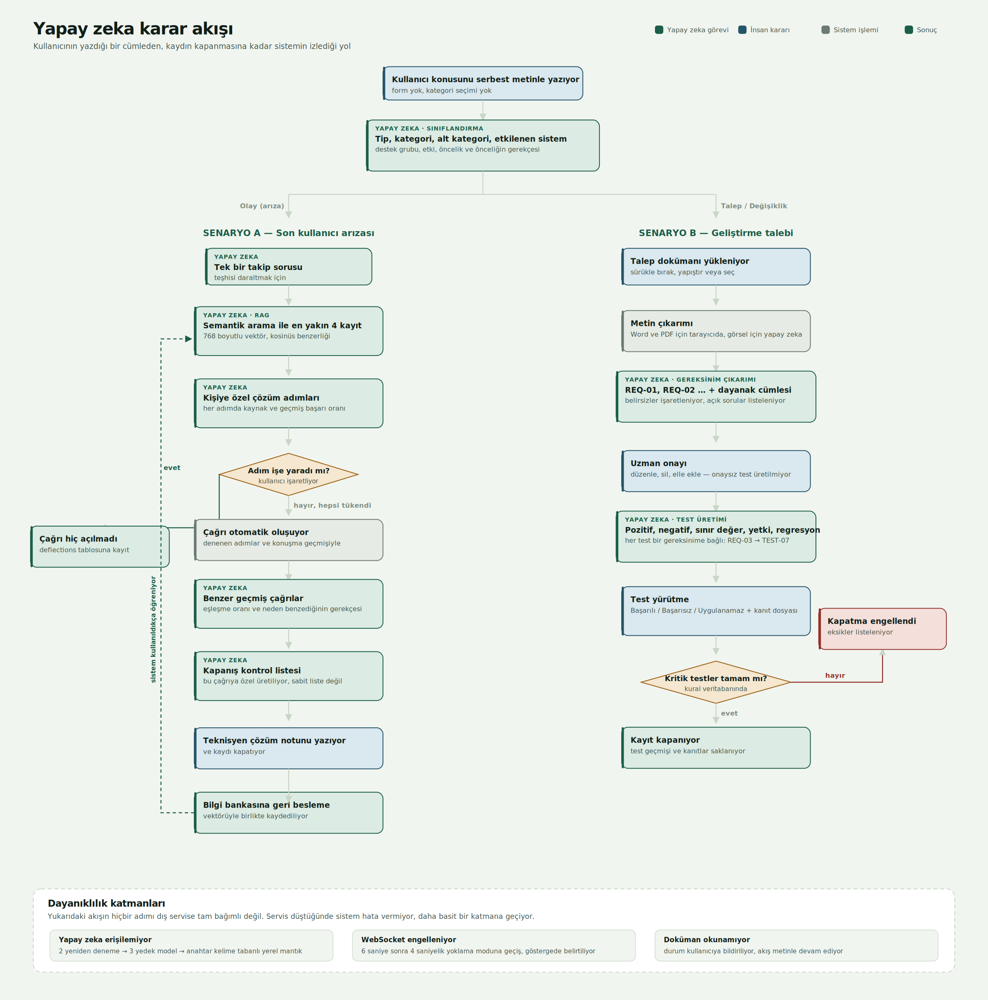
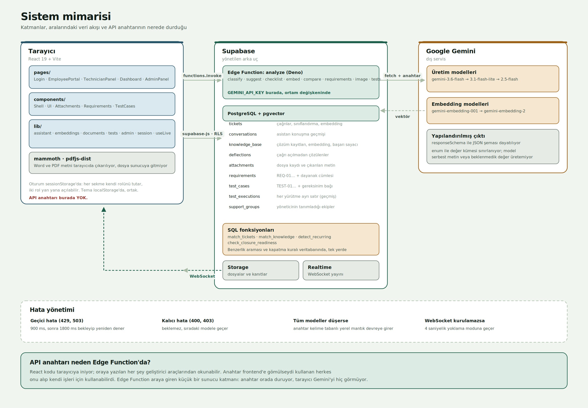

# AI Destekli ITSM Destek Masası

Çağrı açılmadan önce devreye giren bir öneri katmanı, doküman tabanlı
gereksinim çıkarımı ve otomatik test senaryosu üretimi içeren bir BT
destek yönetim uygulaması.



---

## Ne yapıyor

**Çalışan tarafı.** Kullanıcı sorununu serbest metinle yazıyor; form
doldurmuyor, kategori seçmiyor. Sistem sorunu sınıflandırıyor, bağlama
uygun bir takip sorusu soruyor, sonra kişiye özel çözüm adımları
öneriyor. Adımlar işe yararsa çağrı hiç açılmıyor. Yaramazsa çağrı
otomatik oluşuyor ve denenen her şey teknik ekibe aktarılıyor.

**Teknisyen tarafı.** Çağrı anlık olarak düşüyor. Yanında hazır geliyor:
muhtemel nedenler ve önerilen ilk kontroller, anlamca benzeyen geçmiş
çağrılar ve neden benzedikleri, geçmiş verilerden hesaplanmış çözüm
süresi tahmini. Kapatmadan önce çağrıya özel bir kontrol listesi
üretiliyor ve çözüm notu bilgi bankasına yapılandırılmış biçimde
ekleniyor.

**Talep akışı.** Bir geliştirme talebi geldiğinde akış ayrılıyor —
arıza giderme adımı önerilmiyor. Talebe eklenen doküman okunup takip
edilebilir gereksinimlere ayrılıyor (REQ-01, REQ-02…), her biri
dokümandaki dayanak cümlesiyle birlikte. Uzman onayladıktan sonra bu
gereksinimlerden test senaryoları üretiliyor. Kritik işaretli testler
tamamlanmadan kayıt kapatılamıyor.

**Raporlama.** Özet ekranında grafikler, dönem filtresi ve her grafiğin
altında veriden otomatik üretilen bir yorum cümlesi var. Yönetim
panelinden haftalık, aylık veya üç aylık rapor alınabiliyor: önceki
dönemle karşılaştırmalı tablolar, kategori analizi, dikkat gerektiren
kayıtlar ve yapay zekanın yazdığı yönetici özeti. Rapor tarayıcının
kendi çıktısıyla PDF'e kaydediliyor. Rapordaki her sayı veritabanından
geliyor; model yalnızca yorumluyor, rakam üretmiyor.

**Yönetici tarafı.** Kategoriler, destek grupları ve bilgi bankası
buradan yönetiliyor. Bu kayıtlar doğrudan yapay zekanın davranışını
belirliyor: model yalnızca burada tanımlı kategori ve gruplardan seçim
yapabiliyor, yani model yeniden eğitilmeden sistemin davranışı
değiştirilebiliyor.

---

## Mimari



| Katman | Teknoloji | Not |
|---|---|---|
| Arayüz | React 19 + Vite | Tek sayfa uygulama, üç rol için ayrı rotalar |
| Veritabanı | Supabase (PostgreSQL + pgvector) | İlişkisel veri, vektör araması, satır seviyesi güvenlik |
| Gerçek zamanlı | Supabase Realtime | WebSocket; kurulamazsa yoklamaya düşüyor |
| Yapay zeka | Google Gemini | Üretim ve embedding modelleri, yedekli |
| Güvenlik katmanı | Supabase Edge Function (Deno) | API anahtarı burada tutuluyor |

### Klasör yapısı

```
src/
├── lib/            Mantık katmanı — görsel içermez
│   ├── supabase.js       veritabanı bağlantısı
│   ├── assistant.js      sınıflandırma, öneri, benzerlik, uzman özeti
│   ├── embeddings.js     vektör üretimi ve semantik arama
│   ├── documents.js      dosya yükleme, metin çıkarımı, gereksinimler
│   ├── tests.js          test üretimi ve yürütme kayıtları
│   ├── admin.js          bilgi bankası ve grup yönetimi
│   ├── session.js        oturum ve rol koruması
│   ├── useLive.js        canlı veri takibi (WebSocket + yoklama)
│   └── theme.js          renk ve tipografi tanımları
├── components/     Tekrar kullanılan arayüz parçaları
└── pages/          Ekranlar

supabase/functions/analyze/
└── index.ts        On görevli Edge Function
```

### Veri modeli

| Tablo | İçerik |
|---|---|
| `tickets` | Çağrılar, sınıflandırma alanları, embedding |
| `conversations` | Asistanla yapılan konuşmanın tamamı |
| `knowledge_base` | Çözüm kayıtları, embedding, kullanım ve başarı sayaçları |
| `deflections` | Çağrı açılmadan çözülen sorunlar |
| `attachments` | Dosya kayıtları ve çıkarılan metin |
| `requirements` | Dokümandan çıkarılan gereksinimler, dayanak cümleleriyle |
| `test_cases` | Test senaryoları, gereksinim bağıyla |
| `test_executions` | Her yürütme ayrı satır — geçmiş üzerine yazılmıyor |
| `support_groups` | Yöneticinin tanımladığı ekipler |

Benzerlik araması (`match_tickets`, `match_knowledge`), tekrarlayan
problem tespiti (`detect_recurring`), kapatma kuralı
(`check_closure_readiness`) ve süre tahmini (`estimate_resolution`)
veritabanı fonksiyonları olarak yazıldı. İki sebep: binlerce kaydı
tarayıcıya çekmek yerine hesap verinin yanında yapılıyor, ve kural tek
bir yerde duruyor — ileride başka bir arayüz aynı kaydı farklı kuralla
kapatamıyor.

---

## Yapay zeka nasıl kullanılıyor

### On görev

| Görev | İşi |
|---|---|
| `classify` | Tip, kategori, alt kategori, etkilenen sistem, destek grubu, etki, öncelik ve önceliğin gerekçesi |
| `suggest` | Bilgi bankasından getirilen kayıtlarla çözüm adımları |
| `checklist` | Kapanış kontrol listesi ve bilgi bankası taslağı |
| `compare` | Benzer çağrıların neden benzediğinin açıklaması |
| `triage` | Muhtemel nedenler ve önerilen ilk kontroller |
| `requirements` | Dokümandan gereksinim çıkarımı |
| `tests` | Gereksinimlerden test senaryosu üretimi |
| `image` | Ekran görüntüsündeki hata mesajının okunması |
| `embed` | Metnin 768 boyutlu vektöre çevrilmesi |
| `report` | Dönem raporu için yönetici özeti |

### Yapılandırılmış çıktı

Modelden serbest metin istenmiyor. Her görevde `responseSchema` ile
JSON şeması dayatılıyor, `enum` ile değer kümesi sınırlanıyor.

```js
priority: { type: "STRING", enum: ["Yüksek", "Orta", "Düşük"] }
```

Model "acil" veya "kritik" gibi beklenmedik bir değer döndüremiyor.
Arayüz her zaman beklediği veriyi alıyor.

### Semantik arama ve RAG

Anahtar kelime eşleştirmesi "bilgisayarım açılmıyor" ile "makine boot
etmiyor" arasında bağ kuramıyor — ortak kelimeleri yok. Bu yüzden her
kayıt 768 boyutlu bir vektöre çevriliyor ve benzerlik kosinüs
mesafesiyle ölçülüyor.

Vektör boyutu bilinçli olarak 768 seçildi. Modelin varsayılanı 3072
ama Matryoshka tekniğiyle kısaltmaya izin veriyor; 768'de kalite kaybı
düşük, depolama ve arama dört kat hafif.

Çözüm önerisi üretilirken bilgi bankasının tamamı modele
verilmiyor. Önce semantik arama ile en alakalı 4 kayıt getiriliyor,
sadece onlar bağlam olarak veriliyor. Bilgi bankası büyüdükçe istek
şişmiyor ve model alakasız kayıtlar arasında boğulmuyor.

### Kaynak gösterimi ve ölçülmüş oranlar

Her çözüm adımının altında hangi bilgi bankası kaydından geldiği,
eşleşme oranı ve o kaydın geçmiş başarısı yazıyor. Gösterilen iki oran
da hesaplanmış:

- **Eşleşme oranı** kosinüs benzerliğinden geliyor — matematiksel bir ölçüm
- **Başarı oranı** kullanım sayacından geliyor — kayıt kaç kez önerildi,
  kaçında kullanıcı sorunun çözüldüğünü bildirdi

Modele "sence yüzde kaç" diye sorulmuyor. Çözüm süresi tahmini de aynı
şekilde geçmiş çağrıların gerçek sürelerinden hesaplanıyor.

### İnsan kontrolü

Yapay zekanın ürettiği hiçbir şey son söz değil:

- Gereksinimler taslaktır; uzman düzenleyebiliyor, silebiliyor, elle
  ekleyebiliyor. Onaylanmamış gereksinimden test üretilmiyor.
- Test senaryoları düzenlenebiliyor, kritik işareti değiştirilebiliyor.
- Kapatma kontrol listesi işaretlenmeden kayıt kapanmıyor.
- Kritik testler tamamlanmadan kayıt kapanmıyor.
- Gereksinim ve test düzenleme yetkisi, kaydı üstlenen kişiye ait.

### Belirsizlikle başa çıkma

Modele açıkça "eksik bilgiyi kendi kafana göre tamamlama" talimatı
verildi. Doküman bir konuda net değilse gereksinim `ambiguous`
işaretleniyor ve neyin belirsiz olduğu yazılıyor. Ayrıca dokümanın hiç
cevaplamadığı sorular ayrı bir listede toplanıyor.

Uzman özetinde de model teşhis koymuyor, ihtimal sıralıyor — her
muhtemel nedenin yanında olasılık seviyesi ve dayanağı var.

### Dayanıklılık

Dış servise bağımlı her adımda yedek var:

| Durum | Davranış |
|---|---|
| Geçici hata (429, 503) | 900 ms, sonra 1800 ms bekleyip yeniden dener |
| Kalıcı hata (400, 403) | Beklemeden sıradaki modele geçer |
| Ana model kullanılamıyor | İki yedek model sırayla denenir |
| Tüm modeller düşerse | Anahtar kelime tabanlı yerel mantık devreye girer |
| WebSocket kurulamıyor | 4 saniyelik yoklama moduna geçilir, göstergede belirtilir |
| Doküman okunamıyor | Durum kullanıcıya bildirilir, akış metinle devam eder |

### API anahtarı güvenliği

React kodu tarayıcıya iniyor; oraya yazılan her şey geliştirici
araçlarından okunabilir. Anahtar frontend'e gömülseydi uygulamayı
kullanan herkes onu alıp kendi işleri için kullanabilirdi.

Bu yüzden araya bir Supabase Edge Function konuldu. Tarayıcı Gemini'yi
hiç görmüyor, sadece bu fonksiyonu çağırıyor. Anahtar fonksiyonun ortam
değişkeninde duruyor, kodda da yazılı değil.

---

## Kurulum

### Gereksinimler

- Node.js 18 veya üzeri
- Bir Supabase projesi (ücretsiz plan yeterli)
- Google AI Studio'dan alınmış bir Gemini API anahtarı

### 1. Projeyi kurun

```bash
git clone <depo-adresi>
cd it-destek
npm install
```

### 2. Ortam değişkenlerini tanımlayın

`.env.example` dosyasını `.env` olarak kopyalayın ve Supabase
projenizin bilgileriyle doldurun:

```
VITE_SUPABASE_URL=https://xxxxxxxx.supabase.co
VITE_SUPABASE_PUBLISHABLE_KEY=sb_publishable_xxxxxxxx
```

Bu değerler Supabase panelinde **Settings → API** altında.

### 3. Veritabanını hazırlayın

Supabase panelinde **SQL Editor** açın ve `db/db-kurulum.sql`
dosyasının tamamını yapıştırıp çalıştırın. Tek seferde tüm tabloları,
indeksleri, fonksiyonları, güvenlik politikalarını ve başlangıç bilgi
bankasını kurar. Tekrar çalıştırmak güvenlidir; mevcut veriyi silmez.

Gerçekçi geçmiş veriyle denemek isterseniz ardından
`db/ornek-veri-seti.sql` dosyasını da çalıştırın — altı çözülmüş çağrı,
önlenen kayıtlar ve teknisyen katkıları ekler.

### 4. Edge Function'ı yayına alın

```bash
npx supabase login
npx supabase link --project-ref <proje-kodunuz>
npx supabase secrets set GEMINI_API_KEY=<gemini-anahtarınız>
npx supabase functions deploy analyze --no-verify-jwt
```

### 5. Çalıştırın

```bash
npm run dev
```

### 6. Vektörleri üretin

Yönetici olarak giriş yapın → **Yönetim → Sistem → Eksik vektörleri
tamamla**. Bu adım olmadan semantik arama mevcut kayıtları bulamaz.

---

## Arayüz

Açık tema varsayılan; koyu tema sağ üstteki düğmeyle açılabiliyor.
Zemin saf beyaz değil, uzun süre bakınca yormayan soğuk gri-mavi bir
ton. Vurgu rengi indigo; yeşil yalnızca "çözüldü" durumu için
kullanılıyor ki anlamını korusun. Yazı tipi IBM Plex Sans, puntolar
tek bir ölçekten geliyor (12 / 14 / 16 / 20 / 28 / 36). Tüm metin
renkleri zemine karşı ölçüldü ve WCAG AA kontrast eşiğini geçiyor.

## Kullanım

Uygulama üç rolle çalışıyor. Oturum `sessionStorage`'da tutuluyor, yani
her sekme kendi rolünü koruyor — iki rolü ayrı sekmelerde açıp
aralarındaki canlı akışı izleyebilirsiniz.

| Rol | Rota | Yetki |
|---|---|---|
| Çalışan | `/portal` | Sorun bildirme, kendi çağrılarını izleme |
| Teknisyen | `/teknisyen`, `/panel` | Çağrı yönetimi, gereksinim ve test |
| Yönetici | `/yonetim`, `/panel` | Bilgi bankası, gruplar, sistem durumu |

Uçtan uca demo senaryoları için `docs/demo-senaryolari.md` dosyasına
bakın.

---

## Bilinen kısıtlar

**Kimlik doğrulama gerçek değil.** Rol seçimi `sessionStorage`
üzerinden yapılıyor. Üretimde Supabase Auth ile değiştirilmesi ve RLS
politikalarının role bağlanması gerekir. Şu an politikalar demo amaçlı
serbest bırakıldı.

**Veri gizliliği.** Gemini'nin ücretsiz planında gönderilen veriler
model geliştirme için kullanılabiliyor. Kurumsal veride ücretli plana
veya Vertex AI'ya geçilmesi gerekir.

**Çağrı numarası üretimi.** İstemci tarafında rastgele üretiliyor.
Veritabanındaki tekillik kısıtı çakışmayı engelliyor ama kullanıcıya
hata olarak yansıyor. Üretimde veritabanı sequence'ı kullanılmalı.

**Taranmış PDF desteği yok.** Metin katmanı olmayan PDF'lerden içerik
çıkarılamıyor; OCR eklenmesi gerekir.

**Benzerlik eşikleri sabit.** Semantik arama eşikleri (0.35, 0.45,
0.5, 0.62) deneyerek belirlendi. Veri kümesi büyüdükçe yeniden
ayarlanması gerekebilir; bunun ölçülebilir hale getirilmesi faydalı
olur.

**Tek dilli.** Tüm arayüz ve model talimatları Türkçe. Çok dilli
kullanım için talimatların ve arayüz metinlerinin ayrıştırılması
gerekir.

**Ölçek testi yapılmadı.** Sistem birkaç yüz kayıtla test edildi.
Vektör indeksi (IVFFlat) parametreleri on binlerce kayıt için yeniden
ayarlanmalı.

---

## Geliştirilebilecek alanlar

- **Memnuniyet puanı (CSAT)** — çözülen çağrı sonrası kullanıcıdan
  1-5 puan alınması, rapora ve özet ekranına eklenmesi
- **AI performans paneli** — hangi önerilerin kabul/reddedildiği,
  kategori bazında isabet oranı, model yanıt süreleri
- **Doküman revizyon karşılaştırması** — aynı talebe ikinci bir doküman
  yüklendiğinde gereksinimlerdeki farkın gösterilmesi
- **Benzer geliştirmelerin testlerinin önerilmesi** — yeni bir talepte
  geçmiş benzer taleplerin test senaryolarının şablon olarak getirilmesi
- **Reddedilen AI önerilerinin saklanması** — modelin hangi konularda
  yanıldığının ölçülmesi
- **SLA tanımları** — süre tahmini geçmiş veriden geliyor; hedef
  süreler tanımlanıp ihlal takibi ve listede gecikme uyarısı eklenebilir
- **Rapor için CSV çıktısı** — verinin tablolarda işlenebilmesi için
- **E-posta bildirimleri** — durum değişikliklerinde kullanıcıya haber
- **Otomatik atama** — destek grubu ve iş yüküne göre teknisyen ataması

---

## Dokümantasyon

| Dosya | İçerik |
|---|---|
| `docs/demo-senaryolari.md` | Uçtan uca iki demo senaryosu, adım adım |
| `docs/diyagram-ai-akisi.svg` | Yapay zeka karar akışı |
| `docs/diyagram-mimari.svg` | Sistem mimarisi |
| `docs/ornek-talepler/` | İki örnek talep dokümanı (SAP ve İK) |
